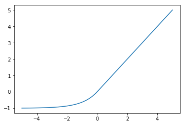
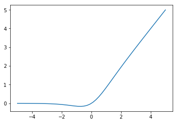
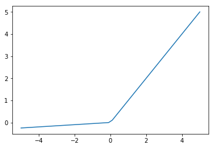
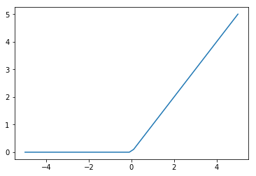
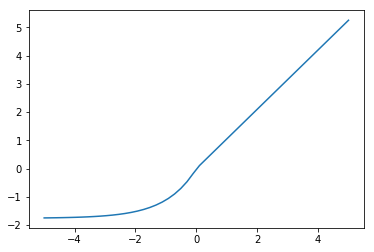
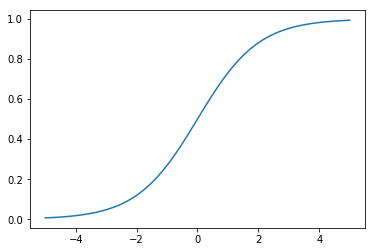
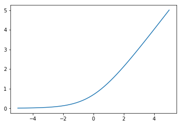
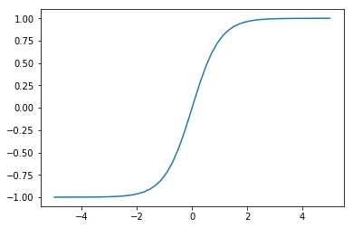

""""""""""""""""""""""""
Activation functions
""""""""""""""""""""""""

CReLU
------

Concatenated ReLU.

.. math::

  f(x) = \text{concat}(\text{ReLU}(x), \text{ReLU}(-x))
  
Using the CReLU doubles the size of the input to the next layer, increasing the number of parameters. However, `Shang et al.  <https://arxiv.org/abs/1603.05201>`_ showed that CReLU can improve accuracy on image recoginition tasks when used for the lower convolutional layers, even when halving the number of filters in those layers at the same time.

| **Proposed in**
| `Understanding and Improving Convolutional Neural Networks via Concatenated Rectified Linear Units, Shang et al. (2016) <https://arxiv.org/abs/1603.05201>`_

ELU
----
Exponential Linear Unit.

.. math:: 

    f(x) = 
    \begin{cases}
      x, & x > 0 \\
      \alpha (\exp(x) - 1), & x \leq 0
    \end{cases}

In practice the hyperparameter :math:`\alpha` is always set to 1.

Compared to ReLUs, ELUs have a mean activation closer to zero which is helpful. However, this advantage is probably nullified by batch normalization.

The more gradual decrease of the gradient should also make them less susceptible to the dying ReLU problem, although they will suffer from the vanishing gradients problem instead.

| **Proposed in**
| `Fast and Accurate Deep Network Learning by Exponential Linear Units (ELUs), Clevert et al. (2015) <https://arxiv.org/abs/1511.07289>`_

GELU
------
Gaussian Error Linear Unit. The name comes from the use of the Gaussian error function in the definition:

.. math::

  f(x) = x \Phi(x)
  
where :math:`\Phi(x)` is the CDF of the normal distribution.

It can be approximated as:

.. math::

  f(x) = x \sigma (1.702 x)

This can be seen as a smoothed version of the ReLU. 

Was found to improve performance on a variety of tasks compared to ReLU and ELU (`Hendrycks and Gimpel (2016) <https://arxiv.org/pdf/1606.08415.pdf>`_). The authors speculate that the activation's curvature and non-monotonicity may help it to model more complex functions.

| **Proposed in**
| `Gaussian Error Linear Units (GELUs), Hendrycks and Gimpel (2016) <https://arxiv.org/pdf/1606.08415.pdf>`_

LReLU
--------
Leaky ReLU. Motivated by the desire to have gradients where the ReLU would have none but the gradients are very small and therefore vulnerable to the vanishing gradients problem in deep networks. The improvement in accuracy from using LReLU instead of ReLU has been shown to be very small (`Maas et al. (2013) <https://ai.stanford.edu/~amaas/papers/relu_hybrid_icml2013_final.pdf>`_).

.. math::

  f(x) = \max\{ax,x\}

:math:`a` is a fixed hyperparameter, unlike the PReLU. A common setting is 0.01.

| **Proposed in**
| `Rectifier Nonlinearities Improve Neural Network Acoustic Models, Maas et al. (2013) <https://ai.stanford.edu/~amaas/papers/relu_hybrid_icml2013_final.pdf>`_

Maxout
--------
An activation function designed to be used with dropout.

.. math::

  f(x) = \max_{j \in [1,k]} x^T W_j + b_j

where :math:`k` is a hyperparameter.

Maxout can be a piecewise linear approximation for arbitrary convex activation functions. This means it can approximate ReLU, LReLU, ELU and linear activations but not tanh or sigmoid.

Was used to get state of the art performance on MNIST, SVHN, CIFAR-10 and CIFAR-100.

| **Proposed in**
| `Maxout Networks, Goodfellow et al. (2013) <https://arxiv.org/pdf/1302.4389.pdf>`_

PReLU
------
Parametric ReLU.

.. math::

  f(x)=\max\{ax,x\}
  
Where :math:`a` is a learned parameter, unlike in the Leaky ReLU where it is fixed.

Was used to achieve state of the art performance on ImageNet (`He et al. (2015) <https://arxiv.org/abs/1502.01852>`_).
  
| **Proposed in**
| `Delving Deep into Rectifiers: Surpassing Human-Level Performance on ImageNet Classification , He et al. (2015) <https://arxiv.org/abs/1502.01852>`_

ReLU
-----
Rectified Linear Unit. Unlike the sigmoid or tanh activations the ReLU does not saturate which has led to it being widely used in deep networks.

.. math::

  f(x)=\max\{0,x\}

The fact that the gradient is 1 when the input is positive means it does not suffer from vanishing and exploding gradients. However, it suffers from its own 'dying ReLU problem' instead.

The Dying ReLU Problem
__________________________
When the input to a neuron is negative, the gradient will be zero. This means that gradient descent will not update the weights so long as the input remains negative. A smaller learning rate helps solve this problem.

The Leaky ReLU and the Parametric ReLU (PReLU) attempt to solve this problem by using :math:`f(x)=\max\{ax,x\}` where a is a small constant like 0.1. However, this small gradient when the input in negative means vanishing gradients are once again a problem.

| **Proposed in**
| `Rectified Linear Units Improve Restricted Boltzmann Machines, Nair and Hinton (2010) <http://citeseerx.ist.psu.edu/viewdoc/download?doi=10.1.1.165.6419&rep=rep1&type=pdf>`_

SELU
-------
Scaled Exponential Linear Unit.

.. math:: 

    f(x) = \lambda
    \begin{cases}
      x, & x > 0 \\
      \alpha (\exp(x) - 1), & x \leq 0
    \end{cases}

Where :math:`\lambda` and :math:`\alpha` are hyperparameters, set to :math:`\lambda =  1.0507` and :math:`\alpha = 1.6733`. 

The SELU is designed to be used in networks composed of many fully-connected layers, as opposed to CNNs or RNNs, the principal difference being that CNNs and RNNs stabilize their learning via weight sharing. As with batch normalization, SELU activations give rise to activations with zero mean and unit variance but without having to explicitly normalize.

The `ELU <https://ml-compiled.readthedocs.io/en/latest/activations.html#elu>`_ is a very similar activation. The only difference is that it has :math:`\lambda =  1` and :math:`\alpha = 1`. 

| **Proposed in**
| `Self-Normalizing Neural Networks, Klambauer et al. (2017) <https://arxiv.org/pdf/1706.02515.pdf>`_

Sigmoid
---------
Activation function that maps outputs to be between 0 and 1.

.. math::

  f(x) = \frac{e^x}{e^x + 1}

Has problems with saturation. This makes vanishing and exploding gradients a problem and initialization extremely important.

Softmax
---------
All entries in the output vector are in the range (0,1) and sum to 1, making the result a valid probability distribution.

.. math:: 

    f(x)_j = \frac{e^{x_j}}{\sum_{k=1}^K e^{x_k}}, j \in {1,...,K}
    
Where :math:`x` is a vector of length :math:`K`. This vector is often referred to as the **logit**.
    
Unlike most other activation functions, the softmax does not apply the same function to each item in the input independently. The requirement that the output vector sums to 1 means that if one of the inputs is increased the others must decrease in the output.

Softplus
----------
Activation whose output is bounded between 0 and infinity, making it useful for modeling quantities that should never be negative such as the variance of a distribution. 

.. math::

  f(x) = \log(1 + e^x)

Unlike the ReLU, gradients can pass through the softmax when :math:`x < 0`. 

Tanh
--------
Activation function that is used in the GRU and LSTM. It is between -1 and 1 and centered around 0, unlike the sigmoid.

.. math::

  f(x) = tanh(x)

Has problems with saturation like the sigmoid. This makes vanishing and exploding gradients a problem and initialization extremely important.
