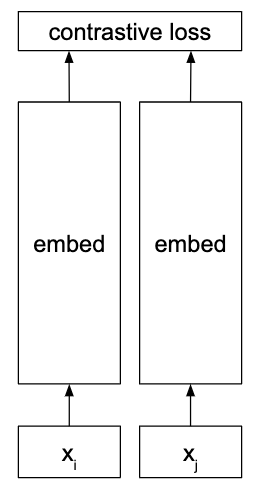
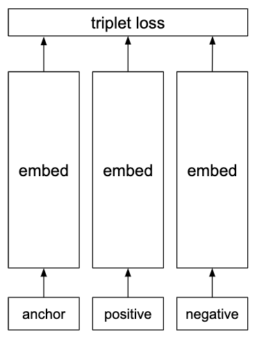

''''''''''''
Embeddings
''''''''''''

""""""""""""""""""""""""""""""""""""
Distributed representation
""""""""""""""""""""""""""""""""""""
A representation in which each number in a vector is used to store information about some attribute of an object. For example, brightness or size.

Distributed representations are much more powerful than one-hot representations. A one-hot vector of length n can store n states, whereas a distributed representation of the same length can store a number of states which is exponential in its length. 

""""""""""""""""""""""""
One-hot representation
""""""""""""""""""""""""
A vector which has zeros everywhere except for in the indices representing the class or classes which are present.

""""""""""""""""""""""""
Siamese network
""""""""""""""""""""""""
An architecture that is often used for calculating similarities, as in `face verification <https://ml-compiled.readthedocs.io/en/latest/computer_vision.html#face-verification>`_ for example.

The network is trained with random pairs of inputs that are either positive (the examples are similar) or negative (they are not similar). Note that weights are shared between the two embedding sections.

Often used with the `contrastive loss <https://ml-compiled.readthedocs.io/en/latest/loss_functions.html#contrastive-loss>`_.

""""""""""""""""""""""""
Triplet network
""""""""""""""""""""""""
Architecture for learning embeddings for calculating similarities. Useful for tasks like `face verification <https://ml-compiled.readthedocs.io/en/latest/computer_vision.html#face-verification>`_.

During each iteration in training, an 'anchor' example is supplied along with a positive that is similar to it and a negative that is not. Each of the three inputs (the anchor, the positive and the negative) are processed separately to produce an embedding for each. 

  
Note that the three embedding sections all share the same weights. 

Uses the `triplet loss <https://ml-compiled.readthedocs.io/en/latest/loss_functions.html#triplet-loss>`_.

"""""""""""""
Word vectors
"""""""""""""
The meaning of a word is represented by a vector of fixed size.

Polysemous words (words with multiple meanings) are hard to model effectively with a single point.

CBOW (Continuous Bag of Words)
-----------------------------------
Used to create word embeddings. Predicts a word given its context. The context is the surrounding n words, as in the skip-gram model. Referred to as a bag of words model as the order of words within the window does not affect the embedding. 

Several times faster to train than the skip-gram model and has slightly better accuracy for words which occur frequently.

| **Proposed in**
| `Efficient Estimation of Word Representations in Vector Space, Mikolov et al. (2013) <https://arxiv.org/abs/1301.3781>`_

GloVe
------
Method for learning word vectors. GloVe is short for 'Global Vectors'.

Unlike the CBOW and skip-gram methods which try to learn word vectors through a classification task (eg predict the word given its context), GloVe uses a regression task. The task is to predict the log frequency of word pairs given the similarity of their word vectors.

The loss function is:

.. math::

  L(X;w,b) = \sum_{i=1}^V \sum_{j=1}^V f(X_{ij}) (w_i^T w_j + b_i + b_j - \log(X_{ij}))^2
  
where :math:`V` is the size of the vocabulary and :math:`X_{ij}` is the number of times word :math:`j` occurs in the context of word :math:`i`. :math:`w_i^T w_j` measures the similarity of the two word vectors.

:math:`f(X_{ij})` is a frequency weighting function. Below the threshold of :math:`x_\text{max}` it gives more weight to frequently occuring pairs than rarer ones but beyond this all pairs are weighted equally. The function is defined as:

.. math::

  f(x) = 
        \begin{cases}
            (x/x_\text{max})^\alpha, & x < x_\text{max} \\
            1, & \text{otherwise}
        \end{cases}
        
:math:`\alpha` and :math:`x_\text{max}` are hyperparameters, set to 0.75 and 100 respectively.

https://nlp.stanford.edu/projects/glove/

| **Proposed in**
| `GloVe: Global Vectors for Word Representation, Pennington et al. (2014) <https://www.aclweb.org/anthology/D14-1162>`_

Skip-gram
-----------
Word-embedding algorithm that works by predicting the context of a word given the word itself. The context is defined as other words appearing within a window of constant size, centered on the word.

For example, let the window size be 2. Then the relevant window is :math:`\{w_{i-2}, w_{i-1},w_i,w_{i+1},w_{i+2}\}`. The model picks a random word :math:`w_k \in \{w_{i-2},w_{i-1},w_{i+1},w_{i+2}\}` and attempts to predict :math:`w_k` given :math:`w_i`.

Increasing the window size improves the quality of the word vectors but also makes them more expensive to compute. Samples less from words that are far away from the known word, since the influence will be weaker. Works well with a small amount of data and can represent even rare words or phrases well.

Augmentations
__________________
The efficiency and quality of the skip-gram model is improved by two additions:

1. Subsampling frequent words. Words like ‘the’ and ‘is’ occur very frequently in most text corpora yet contain little useful semantic information about surrounding words. To reduce this inefficiency words are sampled according to :math:`P(w_i)=1-t/f_i` where :math:`f_i` is the frequency of word i and t is a manually set threshold, usually around 10-5.

2. Negative sampling, a simplification of noise-contrastive estimation.

With some minor changes, skip-grams can also be used to calculate embeddings for phrases such as ‘North Sea’. However, this can increase the size of the vocabulary dramatically.

| **Proposed in**
| `Efficient Estimation of Word Representations in Vector Space, Mikolov et al. (2013) <https://arxiv.org/abs/1301.3781>`_

Word2vec
---------
The name of the implementation of the CBOW and skip-gram architectures in Mikolov et al. (2013)

https://code.google.com/archive/p/word2vec/

`Efficient Estimation of Word Representations in Vector Space, Mikolov et al. (2013) <https://arxiv.org/abs/1301.3781>`_

