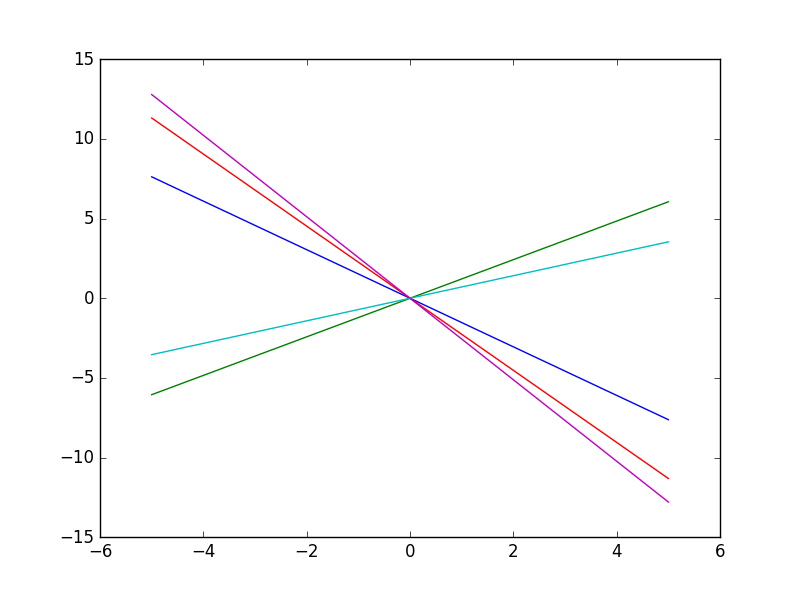
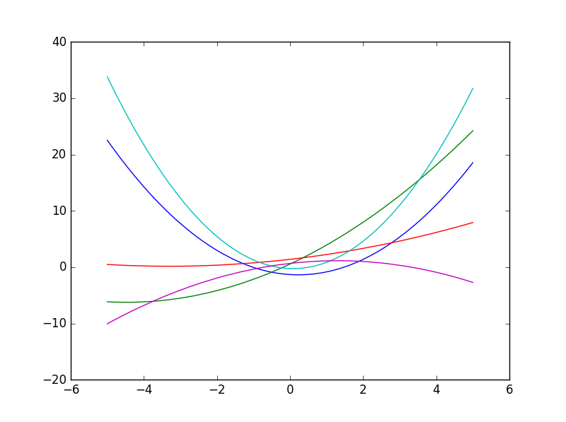
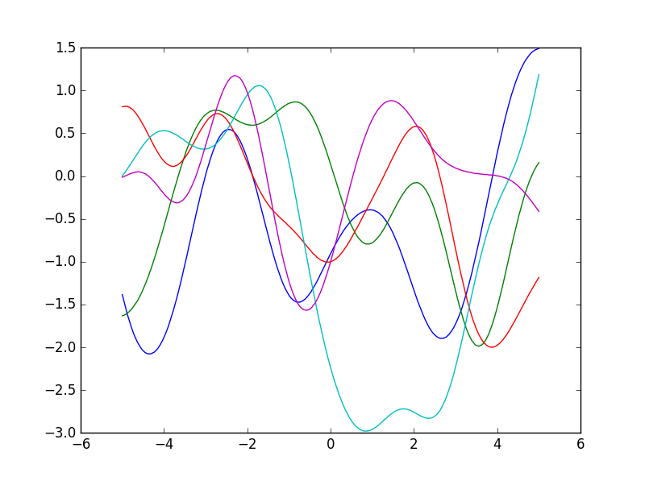
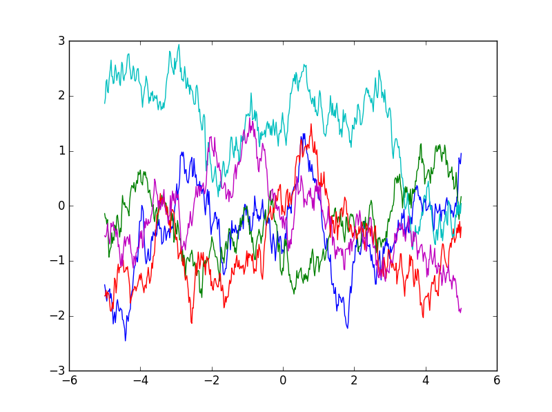

"""""""""""""""""""""""""""
Gaussian processes
"""""""""""""""""""""""""""

Gaussian processes model a probability distribution over functions. 

Let :math:`f(x)` be some function mapping vectors to vectors. Then we can write:

.. math::

  f(x) \sim GP(m(x),k(x,x'))

where :math:`m(x)` represents the mean vector:

.. math::

  m(x) = \mathbb{E}[f(x)]
  
and :math:`k(x,x')` is the kernel function.
  
Kernel function
----------------------
The kernel is a function that represents the `covariance <http://ml-compiled.readthedocs.io/en/latest/statistics.html#covariance>`_ function for the Gaussian process.

.. math::

  k(x,x') = \text{Cov}(f(x),f(x'))

.. math::

  k(x,x') = \mathbb{E}[(f(x) - m(x))(f(x') - m(x'))^T]
  
The kernel can be thought of as a prior for the shape of the function, encoding our expectations for the amount of smoothness or non-linearity.

Not all conceivable kernels are valid. The kernel must produce covariance matrices that are positive-definite.

Linear kernel
_______________

.. math::

  k(x,x') = x \cdot x'
  
Some functions sampled from a Gaussian process with a linear kernel:

  
Polynomial kernel
___________________

.. math::

  k(x,x') = (x \cdot x' + a)^b
  
Functions sampled from a Gaussian process with a polynomial kernel where :math:`a=1` and :math:`b=2`:

  
Gaussian kernel
________________

.. math::

  k(x,x') = \exp({{-||x - x'||}_2^2})
  
Some functions sampled from a GP with a Gaussian kernel:

  
Laplacian kernel
_________________

.. math::

  k(x,x') = \exp({{-||x - x'||}_2})
  
Functions sampled from a GP with a Laplacian kernel:

Sampling
---------
Pseudocode to sample from a Gaussian process:

1. Decide on a vector of inputs :math:`x` for which we want to compute :math:`f(x)`, where :math:`f` is some function which we will sample from the Gaussian process.
2. Compute :math:`K = k(x,x)`.
3. Perform `Cholesky decomposition <https://ml-compiled.readthedocs.io/en/latest/linear_algebra.html#cholesky-decomposition>`_ on :math:`K`, yielding a lower triangular matrix :math:`L`.
4. Sample a vector of numbers from a standard Gaussian distribution.
5. Take the dot product of :math:`L` and the vector of points to get the samples for :math:`f(x)`.
