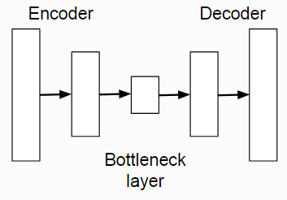

""""""""""""""""""""""""""
Generative networks
""""""""""""""""""""""""""

Models the joint distribution over the features, ignoring any labels, :math:`P(x;\theta)`. 

The model can be estimated by trying to maximise the probability of the observations given the parameters. However, this can be close to intractable for cases like images where the number of possible outcomes is huge.

Autoencoders
--------------
A network for dimensionality reduction that can also be used for generative modelling.

In its simplest form, an autoencoder takes the original input (eg the pixel values of an image) and transforms them into a hidden layer with fewer features than the original. This ‘bottleneck’ means a compressed representation of the input. The part of the network which does this transformation is known as the encoder. The second part of an autoencoder is the decoder which takes the bottleneck layer and uses it to try and reconstruct the original input. This part is known as the decoder.

   
Autoencoders can be used as generative networks by sampling a new hidden state in the bottleneck layer and running it through the decoder.

Convolutional autoencoders
===============================
Composed of standard convolutional layers and upsampling layers.

Denoising Autoencoder (DAE)
===============================
Adds noise to prevent the hidden layer(s) from learning the identity, when the width of the narrowest hidden layer is at least as wide as the input layer.

Variational Autoencoder (VAE)
==================================
Takes noise as input and outputs a sample from the distribution being modelled. 'Variational' refers to the Variational Bayes method which is used to approximate the true objective function with one that is more computable.

In order to modify the standard autoencoder to allow sampling, the distribution of the encoded image vectors is constrained to be roughly Normal(0,1). This means sampling can be done by sampling a random vector from N(0,1) and running the decoder on it.

There are two vectors outputted by the encoder, one for the mean and one for the variance. The closeness of these vectors to the unit Gaussian is measured by the KL-divergence.

The total loss is the sum of the reconstruction loss (mean squared error) and the KL-divergence. The use of the mean squared error means the network tends to produce blurry images. A GAN does not have this problem.

The assumption of independence in the entries of the hidden vector may also contribute to poor results.

Provides better results when combined with a GAN. https://github.com/skaae/vaeblog

Generative Adversarial Network (GAN)
------------------------------------------------
Unsupervised, generative image model. A GAN consists of two components; a generator, G which converts random noise into images and a discriminator, D which tries to distinguish between generated and real images. Here, 'real' means that the image came from the training set of images in contrast to the generated fakes.

Problems
================
* The training process can be unstable when trained solely with the adversarial loss as G can create images to confuse D that are not close to the actual image distribution. D will then learn to discriminate amongst these samples, causing G to create new confusing samples. This problem can be addressed by adding an L2 loss which penalizes a lack of similarity with the input distribution.
* Mode collapse. This is when the network stops generating certain classes (or more generally, modes). For example, it may only create 6’s on MNIST.
* There is no way of telling how well it is doing except by manually inspecting the image outputs. This makes comparing different approaches difficult and early stopping impossible.

Notable variants
===================
* `DCGAN, 2015 <https://arxiv.org/abs/1511.06434>`_ - Has a number of architectural improvements over the original GAN but is not fundamentally different.
* `InfoGAN, 2016 <https://arxiv.org/abs/1606.03657>`_ - Is able to disentangle various aspects like pose vs lighting and digit shape vs writing style.
* `Wasserstein GAN (WGAN), 2017 <https://arxiv.org/abs/1701.07875>`_ - Replaces the original loss function, improving stability. The WGAN-GP (2017) is a further improved version.
* `Boundary Equilibrium GAN (BEGAN), 2017 <https://arxiv.org/abs/1703.10717>`_ - Gets similar quality results as the WGAN-GP.

Further reading
===================
`Generative Adversarial Nets, Goodfellow et al. (2014) <https://arxiv.org/abs/1406.2661>`_

`How to Train a GAN? Tips and tricks to make GANs work, Chintala (2016) <https://github.com/soumith/ganhacks>`_

`Fantastic GANs and where to find them part one <http://guimperarnau.com/blog/2017/03/Fantastic-GANs-and-where-to-find-them>`_ and `two <http://guimperarnau.com/blog/2017/11/Fantastic-GANs-and-where-to-find-them-II>`_

`The GAN Zoo <https://github.com/hindupuravinash/the-gan-zoo>`_

`Are GANs Created Equal? A Large-Scale Study, Lucic et al. (2017) <https://arxiv.org/abs/1711.10337>`_

Generative Autoregressive Networks
------------------------------------
Family of methods for generative models of images and sound, among others. Examples include PixelCNN, PixelRNN and WaveNet.

Multiscale hierarchical architecture.

The sample is generated piece by piece, conditioned on previous predictions.

Example papers
=================
`Pixel Recurrent Neural Networks, van den Oord et al. (2016) <https://arxiv.org/abs/1601.06759>`_

`Conditional Image Generation with PixelCNN Decoders, van den Oord et al. (2016) <https://arxiv.org/abs/1606.05328>`_

`PixelCNN++: Improving the PixelCNN with Discretized Logistic Mixture Likelihood and Other Modifications, Salimans et al. (2016) <https://arxiv.org/abs/1701.05517>`_

`WaveNet: A Generative Model for Raw Audio, van den Oord et al. (2016) <https://arxiv.org/abs/1609.03499>`_

`Neural Machine Translation in Linear Time, Kalchbrenner et al. (2017) <https://arxiv.org/abs/1610.10099>`_

