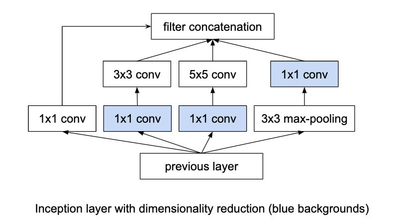
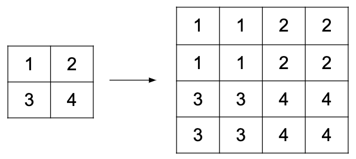

"""""""""""""""
Layers
"""""""""""""""

Affine layer
--------------
Synomym for fully-connected layer.

Attention
------------
An attention layer takes a query vector and uses it, combined with key vectors, to compute a weighted sum of value vectors. If a key is determined to be highly compatible with the query the weight for the associated value will be high.

Attention has been used to improve image classification, image captioning, speech recognition, generative models and learning algorithmic tasks, but has probably had the largest impact on neural machine translation.

Computational complexity
__________________________
When using two RNNs (an encoder and a decoder) to translate a sequence of length :math:`n` the time complexity is :math:`O(n)`.

However, a soft attention mechanism must look over every item in the input sequence for every item in the output sequence, resulting in a quadratic complexity:  :math:`O(n^2)`.

Additive attention
__________________________

Let :math:`x = \{x_1,...,x_T\}` be the input sequence and :math:`y = \{y_1,...,y_U\}` be the output sequence.

There is an encoder RNN whose hidden state at index :math:`t` we refer to as :math:`h_t`. The decoder RNN's state at time :math:`t` is :math:`s_t`.

Attention is calculated over all the words in the sequence form a weighted sum, known as the context vector. This is defined as:

.. math::

  c_t = \sum_{j=1}^{T} \alpha_{tj} h_j
  
where :math:`\alpha_{tj}` is the jth element of the softmax of :math:`e_t`.

The attention given to a particular input word depends on the hidden states of the encoder and decoder RNNs.

.. math::

  e_{tj} = a(s_{t-1}, h_j) 
  
The decoder's hidden state is computed according to the following expression, where :math:`f` represents the decoder.

.. math::

  s_i = f(s_{t-1},y_{t-1},c_t)

To predict the output sequence we take the decoder hidden state and the context vector and feed them into a fully connected softmax layer :math:`g` which gives a distribution over the output vocabulary.

.. math::

  y_t = g(s_t,c_t)
  
| **Proposed in** 
| `Neural Machine Translation by Jointly Learning to Align and Translate, Bahdanau et al. (2015) <https://arxiv.org/abs/1409.0473>`_
  
Dot-product attention
__________________________
Returns a weighted average over the values, :math:`V`.

.. math::

  \text{Attention}(Q,K,V) = \text{softmax}(QK^T)V

Where :math:`Q` is the query matrix, :math:`K` is the matrix of keys and :math:`V` is the matrix of values. :math:`\text{softmax}(QK^T)` determines the weight of each value in the result, based on the similarity between the query and the value's corresponding key.

The queries and keys have the same dimension.

The query might be the hidden state of the decoder, the key the hidden state of the decoder and the value the word vector at the corresponding position.

Scaled dot-product attention
'''''''''''''''''''''''''''''
Adds a scaling factor :math:`\sqrt{d_k}`, equal to the dimension of :math:`K`:

.. math::

  \text{Attention}(Q,K,V) = \text{softmax}(\frac{QK^T}{\sqrt{d_k}})V

This addition to the formula is intended to ensure the gradients do not become small when :math:`d_k` grows large.

| **Proposed in** 
| `Attention is All You Need (2017) <https://arxiv.org/pdf/1706.03762.pdf>`_

Hard attention
__________________________
Form of attention that attends only to one input, unlike soft attention. Trained using the REINFORCE algorithm since, unlike other forms of attention, it is not differentiable.

Self-attention
__________________________

| **Proposed in** 
| `Attention is All You Need (2017) <https://arxiv.org/pdf/1706.03762.pdf>`_

Soft attention
__________________________
Forms of attention that attend to every input to some extent, meaning they can be trained through backpropagation. Contrast with hard attention, which attends exclusively to one input.

Batch normalization
-------------------------
Normalizes the input vector to a layer to have zero mean and unit variance, making training more efficient. Training deep neural networks is complicated by the fact that the distribution of each layer’s inputs changes during training, as the parameters of the previous layers change. This slows down the training by requiring lower learning rates and careful parameter initialization. This phenomenon is referred to as internal covariate shift.

Batch Normalization is often found to improve generalization performance (`Zhang et al. (2016) <https://arxiv.org/pdf/1611.03530.pdf>`_).

Training
_________________
The batch-normalized version of a layer, :math:`x`, is:

.. math::

  BN(x) = \gamma \frac{x - \mu_x}{\sqrt{\sigma_x^2 + \epsilon}} + \beta
  
Where :math:`\gamma` and :math:`\beta` are learned and :math:`\epsilon` is a hyperparameter. If there are multiple batch normalization layers a separate :math:`\gamma` and :math:`\beta` will be learned for each of them.

:math:`\mu_x` and :math:`\sigma_x^2` are moving averages of the mean and variance of :math:`x`. They do not need to be learned.

Inference
___________
Batch normalization's stabilizing effect is helpful during training but unnecessary at inference time. Therefore, once the network is trained the population mean and variance are used for normalization, rather than the batch mean and variance. This means the networks output can depend only on the input, not also on other examples in the batch.

Application to RNNs
____________________
Batch normalization is difficult to apply to RNNs since it requires storing the batch statistics for every time step in the sequence. This can be problematic if a sequence input during inference is longer than those seen during training.

| **Proposed in** 
| `Batch Normalization: Accelerating Deep Network Training by Reducing Internal Covariate Shift (2015) <https://arxiv.org/abs/1502.03167>`_

Conditional batch normalization
________________________________
The formula is exactly the same as normal batch normalization except :math:`\gamma` and :math:`\beta` are not learned parameters, but rather the outputs of functions.

Was used to achieve `state of the art results <https://arxiv.org/pdf/1707.03017.pdf>`_ on the CLEVR visual reasoning benchmark.

`Learning Visual Reasoning Without Strong Priors, Perez et al. (2017) <https://arxiv.org/pdf/1707.03017.pdf>`_

Convolutional layer
-----------------------
Transforms an image according to the convolution operation shown below, where the image on the left is the input and the image being created on the right is the output:

TODO

Let :math:`x` be a matrix representing the image and :math:`k` be another representing the kernel, which is of size NxN. :math:`c(x,k)` is the matrix that results from convolving them together. Then, formally, convolution applies the following formula:

.. math::

  c(x,k)_{ij} = \sum_{r=-M}^{M} \sum_{s=-M}^{M} x_{i+r,j+s} k_{r+M,s+M}
  
Where :math:`M = (N - 1)/2`.

Padding
__________________________
Applying the kernel to pixels near or at the edges of the image will result in needing pixel values that do not exist. There are two ways of resolving this:

* Only apply the kernel to pixels where the operation is valid. For a kernel of size k this will reduce the image by :math:`(k-1)/2` pixels on each side.
* Pad the image with zeros to allow the operation to be defined.

Efficiency
__________________________
The same convolution operation is applied to every pixel in the image, resulting in a considerable amount of weight sharing. This means convolutional layers are quite efficient in terms of parameters. Additionally, if a fully connected layer was used to represent the functionality of a convolutional layer most of its parameters would be zero since the convolution is a local operation. This further increases efficiency.

The number of parameters can be further reduced by setting a stride so the convolution operation is only applied every m pixels.

1x1 convolution
__________________________
These are actually matrix multiplications, not convolutions. They are a useful way of increasing the depth of the neural network since they are equivalent to :math:`f(hW)`, where :math:`f` is the activation function.

If the number of channels decreases from one layer to the next they can be also be used for dimensionality reduction.

http://iamaaditya.github.io/2016/03/one-by-one-convolution/

Dilated convolution
__________________________
Increases the size of the receptive field of the convolution layer.

Used in `WaveNet: A Generative Model for Raw Audio, van den Oord et al. (2016) <https://arxiv.org/abs/1609.03499>`_.

Separable convolution/filter
__________________________
A filter or kernel is separable if it (a matrix) can be expressed as the product of a row vector and a column vector. This decomposition can reduce the computational cost of the convolution. Examples include the Sobel edge detection and Gaussian blur filters.

.. math::

  K = xx^T, x \in \mathbb{R}^{n \times 1}

Transposed convolutional layer
__________________________________
Sometimes referred to as a deconvolutional layer. Can be used for upsampling. 

Pads the input with zeros and then applies a convolution. Has parameters which must be learned, unlike the upsampling layer.

Dense layer
--------------
Synomym for fully-connected layer.

Fully-connected layer
-----------------------
Applies the following function:

.. math::

  h' = f(hW + b)
  
:math:`f` is the activation function. :math:`h` is the output of the previous hidden layer. :math:`W` is the weight matrix and :math:`b` is known as the bias vector.

Hierarchical softmax
----------------------
A layer designed to improve efficiency when the number of output classes is large. Its complexity is logarithmic in the number of classes rather than linear, as for a standard softmax layer.

A tree is constructed where the leaves are the output classes.

Alternative methods include `Noise Contrastive Estimation <https://ml-compiled.readthedocs.io/en/latest/loss_functions.html#noise-contrastive-estimation>`_ and `Negative Sampling <https://ml-compiled.readthedocs.io/en/latest/loss_functions.html#negative-sampling>`_.

`Classes for Fast Maximum Entropy Training, Goodman (2001) <https://arxiv.org/abs/cs/0108006>`_

Inception layer
--------------------
Using convolutional layers means it is necessary to choose the kernel size (1x1, 3x3, 5x5 etc.). Inception layers negate this choice by using multiple convolutional layers with different kernel sizes and concatenating the results.

Padding can ensure the different convolution sizes still have the same size of output. The pooling component can be concatenated by using a stride of length 1 for the pooling.

5x5 convolutions are expensive so the `1x1 convolutions <https://ml-compiled.readthedocs.io/en/latest/layers.html#x1-convolutions>`_ make the architecture computationally viable. The 1x1 convolutions perform dimensionality reduction by reducing the number of filters. This is not a characteristic necessarily found in all 1x1 convolutions. Rather, the authors have specified to have the number of output filters less than the number of input filters.

9 inception layers are used in GoogLeNet, a 22-layer deep network and state of the art solution for the ILSVRC in 2014.

| **Proposed in**
| `Going deeper with convolutions, Szegedy et al. (2014) <https://arxiv.org/pdf/1409.4842.pdf>`_

Layer normalization
----------------------
Can be easily applied to RNNs, unlike batch normalization.

| **Proposed in** 
| `Layer Normalization, Ba et al. (2016) <https://arxiv.org/abs/1607.06450>`_

Pooling layer
---------------

Max pooling
__________________________
Transforms the input by taking the max along a particular dimension. In sequence processing this is usually the length of the sequence.

Mean pooling
__________________________
Also known as average pooling. Identical to max-pooling except the mean is used instead of the max.

RoI pooling
__________________________
Used to solve the problem that the `regions of interest (RoI) <https://ml-compiled.readthedocs.io/en/latest/computer_vision.html#region-of-interest>`_ identified by the bounding boxes can be different shapes in object recognition. The CNN requires all inputs to have the same dimensions.

The RoI is divided into a number of rectangles of fixed size (except at the edges). If doing 3x3 RoI pooling there will be 9 rectangles in each RoI. We do max-pooling over each RoI to get 3x3 numbers.

Softmax layer
----------------
A fully-connected layer with a `softmax <https://ml-compiled.readthedocs.io/en/latest/activations.html#softmax>`_ activation function.

Upsampling layer
-----------------
Simple layer used to increase the size of its input by repeating its entries. Does not have any parameters. 

Example of a 2D upsampling layer:

