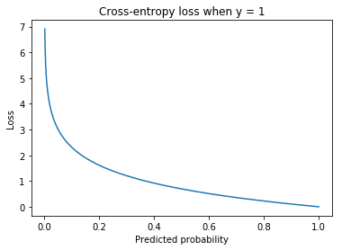
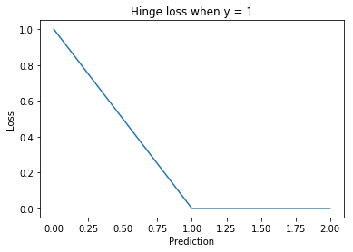
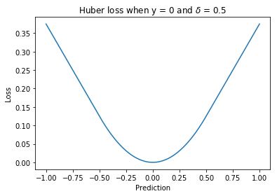
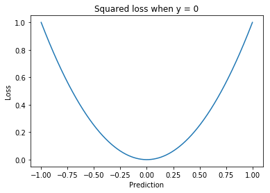

Loss functions
"""""""""""""""""
For classification problems, :math:`y` is equal to 1 if the example is a positive and 0 if it is a negative. :math:`\hat{y}` can take on any value (although predicting outside of the (0,1) interval is unlikely to be useful).

Classification
-----------------

Cross-entropy loss
_____________________
Loss function for classification.

.. math::

  L(y,\hat{y}) = -\sum_i \sum_c y_{i,c} \log(\hat{y}_{i,c})

where c are the classes. :math:`y_{i,c}` equals 1 if example :math:`i` is in class :math:`c` and 0 otherwise. :math:`\hat{y}_{i,c}` is the predicted probability that example :math:`i` is in class :math:`c`.

For discrete distributions (ie classification problems rather than regression) this is the same as the negative log-likelihood loss.

Hinge loss
______________
Let positives be encoded as :math:`y = 1` and negatives as :math:`y = -1`. Then the hinge loss is defined as:

.. math::

  L(y,\hat{y}) = \max\{0, m - y \hat{y}\}

The margin :math:`m` is a hyperparameter that is commonly set to 1.

  
Used for training SVMs.

Focal loss
___________
Variant of the cross-entropy loss, designed for use on datasets with severe class imbalance. It is defined as:

.. math::

  L(p) = -(1 - p)^\gamma \log(p)
  
Where :math:`\gamma` is a hyperparameter that determines the relative importance of the classes. If :math:`\gamma = 0` the focal loss is equivalent to the cross-entropy loss. 

| **Proposed in**
| `Focal Loss for Dense Object Detection, Lin et al. (2017) <https://arxiv.org/pdf/1708.02002.pdf>`_

Noise Contrastive Estimation
________________________________
Like negative sampling, this is a technique for efficient learning when the number of output classes is large. Useful for language modelling.

A binary classification task is created to disambiguate pairs that are expected to be close to each other from ‘noisy’ examples put together at random. 

In essence, rather than estimating :math:`P(y|x)`, NCE estimates :math:`P(C=1|x,y)` where :math:`C = 1` if :math:`y` has been sampled from the real distribution and :math:`C = 0` if :math:`y` has been sampled from the noise distribution.

NCE makes training time at the output layer independent of the number of classes. It remains linear in time at evaluation, however.

.. math::

  L(x,y) = -\sum_i \log(P(C_i=1|x_i,y_i)) + \sum_{j = 1}^k \log(1 - P(C_i=1|x_i,y^n_j))
      
:math:`k` is a hyperparameter, denoting the number of noise samples for each real sample. :math:`y_i` is a label sampled from the data distribution and :math:`y^n_j` is one sampled from the noise distribution. :math:`C_i = 1` if the pair :math:`(x,y)` was drawn from the data distribution and 0 otherwise.

| `Noise Contrastive Estimation: A New Estimation Principle for Unnormalized Statistical Models, Gutmann and Hyvarinen (2010) <http://proceedings.mlr.press/v9/gutmann10a/gutmann10a.pdf>`_
| `Learning Word Embeddings Efficiently with Noise Contrastive Estimation, Mnih and Kavukcuoglu (2013) <https://papers.nips.cc/paper/5165-learning-word-embeddings-efficiently-with-noise-contrastive-estimation>`_
| `RNNLM Training with NCE for Speech Recognition, Chen et al. (2015) <https://www.repository.cam.ac.uk/bitstream/handle/1810/247439/Chen_et_al-2015-ICASSP.pdf?sequence=1>`_

Embeddings
-------------

Contrastive loss
___________________
Loss function for learning embeddings, often used in face verification. 

The inputs are pairs of examples :math:`x_1` and :math:`x_2` where :math:`y = 1` if the two examples are of the similar and :math:`0` if not.

.. math::

  L(x_1,x_2,y) = y d(x_1,x_2)^2 + (1 - y) \max\{0, m - d(x_1,x_2)\}^2
  
Where :math:`x_1` and :math:`x_2` are the embeddings for the two examples and :math:`m` is a hyperparameter called the margin. :math:`d(x,y)` is a distance function, usually the `Euclidean distance <https://ml-compiled.readthedocs.io/en/latest/high_dimensionality.html#euclidean-distance>`_.

Intuition
'''''''''''''
If :math:`y = 1` the two examples :math:`x_1` and :math:`x_2` are similar and we want to minimize the distance :math:`d(x_1,x_2)`. Otherwise (:math:`y = 0`) we wish to maximize it.

The margin
''''''''''''
If :math:`y = 0` we want to make :math:`d(x_1,x_2)` as large as possible to minimize the loss. However, beyond the threshold for classifying the example as a negative increasing this distance will not have any effect on the accuracy. The margin ensures this intuition is reflected in the loss function. Using the margin means increasing :math:`d(x_1,x_2)` beyond :math:`m` has no effect.

There is no margin for when :math:`y = 1`. This case is naturally bounded by 0 as the Euclidean distance cannot be negative.

Example paper
'''''''''''''''
`Deep Learning Face Representation by Joint Identification-Verification, Sun et al. (2014) <https://arxiv.org/pdf/1406.4773.pdf>`_

Negative sampling
____________________
The problem is reframed as a binary classification problem.

.. math::

  L(x_0,x_1,y) = y\log \sigma(f(x_0) \cdot f(x_1)) + (1-y_i)\log(\sigma(-f(x_0) \cdot f(x_1)))
  
where :math:`x_0` and :math:`x_1` are two examples, :math:`f` is the learned embedding function and :math:`y = 1` if the pair :math:`(x_0,x_1)` are expected to be similar and :math:`y = 0` otherwise. The dot product measures the distance between the two embeddings.

Noise Contrastive Estimation
__________________________________
A binary classification task is created to disambiguate pairs that are expected to be close to each other from ‘noisy’ examples put together at random. 

.. math::

  L(x_0,x_1,y) = y\log \sigma(f(x_0) \cdot f(x_1)) + (1-y_i)\log(1-\sigma(f(x_0) \cdot f(x_1)))

where :math:`x_0` and :math:`x_1` are two examples, :math:`f` is the learned embedding function and :math:`y = 1` if the pair :math:`(x_0,x_1)` are expected to be similar and :math:`y = 0` if not (because they have been sampled from the noise distribution). The dot product measures the distance between the two embeddings and the sigmoid function transforms it to be between 0 and 1 so it can be interpreted as a prediction for a binary classifier.

This means maximising the probability that actual samples are in the dataset and that noise samples aren’t in the dataset. Parameter update complexity is linear in the size of the vocabulary. The model is improved by having more noise than training samples, with around 15 times more being optimal.

Triplet loss
--------------
Used for training embeddings with `triplet networks <https://ml-compiled.readthedocs.io/en/latest/embeddings.html#triplet-network>`_. A triplet is composed of an anchor (:math:`a`), a positive example (:math:`p`) and a negative example (:math:`n`). The positive examples are similar to the anchor and the negative examples are dissimilar.

.. math::

  L(a,p,n) = \sum_i \max\{0, m + d(a_i,p_i) - d(a_i,n_i)\}
  
Where :math:`m` is a hyperparameter called the margin. :math:`d(x,y)` is a distance function, usually the the `Euclidean distance <https://ml-compiled.readthedocs.io/en/latest/high_dimensionality.html#euclidean-distance>`_.

The margin
______________
We want to minimize :math:`d(a_i,p_i)` and maximize :math:`d(a_i,n_i)`. The former is lower-bounded by 0 but the latter has no upper bound (distances can be arbitrarily large). However, beyond the threshold to classify a pair as a negative, increasing this distance will not help improve the accuracy, a fact which needs to be reflected in the loss function. The margin does this by ensuring that there is no gain from increasing :math:`d(a_i,n_i)` beyond :math:`m + d(a_i,p_i)` since the loss will be set to 0 by the maximum.

Ranking
----------

Lambda Loss
_____________

| **Proposed in**
| `The LambdaLoss Framework for Ranking Metric Optimization, Wang et al. (2018) <https://storage.googleapis.com/pub-tools-public-publication-data/pdf/1e34e05e5e4bf2d12f41eb9ff29ac3da9fdb4de3.pdf>`_

Regression
---------------

Huber loss
_____________
A loss function used for regression. It is less sensitive to outliers than the squared loss since there is only a linear relationship between the size of the error and the loss beyond :math:`\delta`.

.. math::

  L(y,\hat{y};\delta) = 
          \begin{cases}
              \frac{1}{2}(y - \hat{y})^2, & \ |y - \hat{y}| \leq \delta \\
              \delta(|y - \hat{y}| - \frac{1}{2}\delta), & \text{otherwise}
          \end{cases}
          
Where :math:`\delta` is a hyperparameter.         

  
Squared loss
_______________
A loss function used for regression. 

.. math::

  L(y,\hat{y}) = \sum_i (y_i - \hat{y}_i)^2

Disadvantages
''''''''''''''''
The squaring means this loss function weights large errors more than smaller ones, relative to the magnitude of the error. This can be particularly harmful in the case of outliers. One solution is to use the `Huber loss <http://ml-compiled.readthedocs.io/en/latest/loss_functions.html#huber-loss>`_.

