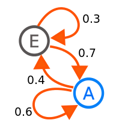

"""""""""""""""""""""""""""""""""""
Probabilistic graphical models
"""""""""""""""""""""""""""""""""""

Bayesian network
------------------
A directed acyclic graph where the nodes represent random variables.

Not to be confused with Bayesian neural networks.

The chain rule for Bayesian networks
______________________________________

The joint distribution for all the variables in a network is equal to the product of the distributions for all the individual variables, conditional on their parents.

.. math::

    P(X_1,...,X_n) = \prod_i P(X_i|Par(X_i))

where :math:`Par(X_i)` denotes the parents of the node :math:`X_i` in the graph.

Clique
-------
A subset of a graph where the nodes are fully-connected, ie each node has an edge with every other node in the set.

Conditional Random Field (CRF)
---------------------------------
Discriminative model often used for sequential data.

Hidden Markov Model (HMM)
---------------------------
A simple generative sequence model in which there is an observable state and a latent state, which must be inferred. 

At each time step the model is in a latent state :math:`x_t` and outputs an observation :math:`y_t`. The observation is solely a function of the latent state, as is the probability distribution over the next state, :math:`x_{t+1}`. Hence the model obeys the `Markov property <https://ml-compiled.readthedocs.io/en/latest/probabilistic_graphical_models.html#markov-property>`_.

The model is defined by:

* A matrix :math:`T` of transition probabilities where :math:`T_{ij}` is the probability of going from state i to state j.
* A matrix :math:`E` of emission probabilities where :math:`E_{ij}` is the probability of emitting observation j in state i.

The parameters can be learnt with the Baum-Welch algorithm.

Markov chain
--------------
A simple state transition model where the next state depends only on the current state. At any given time, if the current state is node i, there is a probability :math:`T_{ij}` of transitioning to node j, where :math:`T` is the transition matrix.

  
  Source: https://en.wikipedia.org/wiki/Markov_chain#/media/File:Markovkate_01.svg

Markov property
--------------------
A process is said to have the Markov property if the next state depends only on the current state, not any of the previous ones.

Markov Random Field (MRF)
---------------------------
A type of undirected graph which defines the joint probability distribution over a set of variables. Each variable is represented by one node in the graph.
